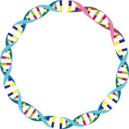

  
# Wobble514

**Turning biological questions into reproducible code.**

---

## About

With a passion for biology above all else, I am developing skills in bioinformatics alongside my biology studies by teaching myself programming and statistics. Every
project here is documented from the starting question through to
reproducible results.

## Projects

- ### [gc-content-fasta](https://github.com/Wobble514/gc-content-fasta)
Command-line tool computing the GC content of every sequence in a FASTA file.
Handles multi-line records, mixed case, and ambiguous bases; tested on real
bacterial genomes from NCBI spanning 31.7% to 72.1% GC.
`Python` · `no dependencies`

- ### [paris-2026-turnout](https://github.com/Wobble514/paris-2026-turnout)
Multiple linear regression explaining voter turnout across 17 electoral
sectors from socioeconomic predictors. AICc model selection, collinearity
diagnostics (VIF), identification of a suppression effect, and full residual
validation. Adjusted R² = 0.887.
`R` · `Quarto` · `tidyverse`

## Tech stack

**Languages**: Python, R, Bash      
**Statistics**: linear models, model selection, regression diagnostics, non-parametric tests
**Tools**: Git, Linux, Quarto

## Currently learning

- Python for bioinformatics (practising on [Rosalind](https://rosalind.info))
- Working through [Resources for Learning Bioinformatics and Computational Biology](https://learnbioinformatics.org/)

 In tribute to Rosalind Franklin.

